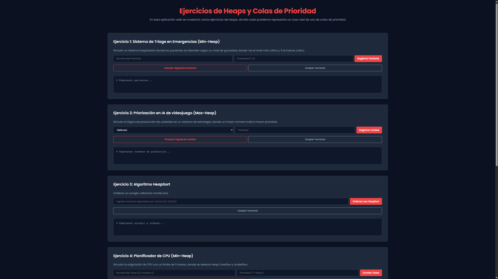

# Repositorio de Estructuras de Datos

Este es mi repositorio donde comparto todas mis prácticas de la materia de Estructura de Datos.

Este repositorio contiene los codigos desarrollados a lo largo del semestre, divididos por sus respectivas unidades.

---

## Contenido del Repositorio

A continuación se presentan las carpetas principales que estructuran mi trabajo:

- Ejercicios Basicos
- Unidad 5: Heaps y Colas de Prioridad
- Unidad 6: Tablas Hash

### Detalle de Proyectos

El repositorio contiene **varios proyectos**, algunos finalizados y otros en proceso de entrega. 

| Directorio | Tema Principal | Estado Actual |
| :--- | :---: | ---: |
| ejercicios | Listas Enlazadas | **Completado** |
| unidad5_heaps | Heaps y Colas de Prioridad | **Completado** |
| unidad6_hash | Funciones Hash | **En Desarrollo** |

El directorio de la unidad 6 aún se encuentra en fase inicial y no está terminado.

---

## Instalación y Uso

Sigue estos pasos cuidadosamente para ejecutar el **proyecto de la Unidad 5** en tu computadora:

1. Clona el repositorio o descarga los archivos.
2. Abre una terminal en la carpeta principal del proyecto.
3. Ejecuta los siguientes comandos para crear y activar el entorno virtual:

~~~
python -m venv venv
.\venv\Scripts\activate
pip install -r requirements.txt
~~~

4. Navega a la subcarpeta del proyecto y activa el servidor usando los comandos a continuación:
~~~
    cd unidad5_heaps
    python main.py
~~~

5. Abre tu navegador y entra al siguiente link: [Heaps y Colas de Prioridad](http://127.0.0.1:8000)

---

## Vista de la Aplicación

---

## Manual de Usuario (Unidad 5)

La aplicación web está dividida en 5 paneles interactivos, cada uno representando un ejercicio de la rúbrica:

1. **Ejercicio 1 (Sistema de Triage en Emergencias utilizando Min-Heap):** Ingresa el nombre del paciente y su nivel de gravedad (1-5). El sistema lo agregará a la fila y siempre atenderá primero a los casos más graves (Gravedad 1).

2. **Ejercicio 2 (Priorización en IA de Videojuego utilizando Max-Heap):** Selecciona el tipo de tropa y asígnale una prioridad numérica. Usa el botón de producir para extraer siempre la orden con la prioridad más alta.

3. **Ejercicio 3 (Algoritmo HeapSort):** Ingresa una lista de números separados por comas (ej. `10, 5, 20`). Al darle clic a "Ordenar", la consola virtual te mostrará el paso a paso de cómo el algoritmo construye el heap y ordena el arreglo.

4. **Ejercicio 4 (Planificador CPU utilizando Min-Heap):** Ingresa tareas con su prioridad. La cola tiene un límite máximo de **5 procesos**. Si intentas meter un sexto, la consola te mostrará la excepción de *HeapOverflow*. Si intentas extraer de una cola vacía, verás la alerta de *HeapUnderflow*.

5. **Ejercicio 5 (Algoritmo de Dijkstra utilizando Min-Heap):** Selecciona el nodo de inicio (A, B, C o D) y haz clic en "Ejecutar". La consola te mostrará detalladamente cómo el algoritmo viaja por el grafo, encuentra los atajos, aplica la operación matemática y calcula la distancia más corta hacia cada destino final.
